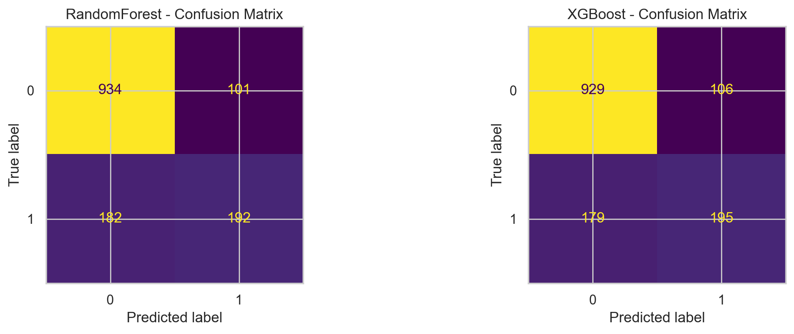
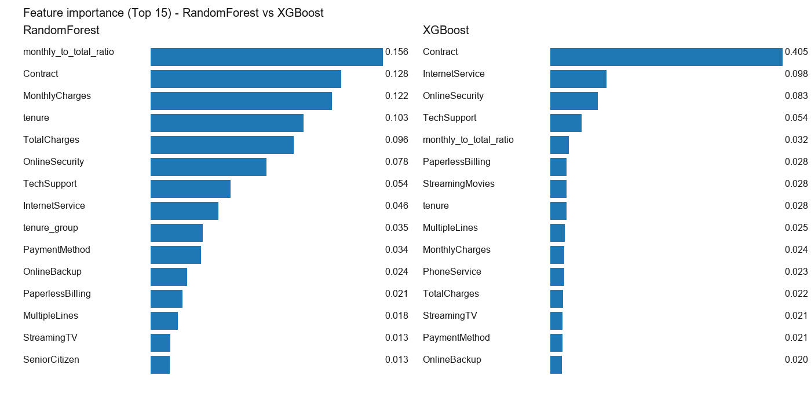

# Prédiction du Churn Client (Telco) — Rapport

## 1. Résumé exécutif

Objectif : prédire le churn client et comparer **RandomForest** et **XGBoost** sur le dataset Telco Customer Churn.

Principaux résultats (jeu de test) :

- Les deux modèles obtiennent des performances proches.  
- **XGBoost** est légèrement meilleur sur le ROC-AUC et le F1-score dans cette exécution.  
- Le **seuil de décision est un choix métier**. Dans notre analyse, un seuil de **0,3** améliore le rappel et le F1 au prix d’un plus grand nombre de clients signalés pour rétention.

## 2. Contexte & problématique métier

La prédiction du churn aide une entreprise à prioriser les actions de rétention (réductions, appels, actions Customer Success) vers les clients susceptibles de partir.

Deux contraintes typiques :

- Les actions de rétention ont un coût (budget, temps humain, coût des remises).  
- Rater des churners peut être très coûteux (perte de revenus récurrents).

Ainsi, l’évaluation du modèle doit aller au-delà de la simple accuracy.

## 3. Jeu de données

- Source : Telco Customer Churn dataset (`WA_Fn-UseC_-Telco-Customer-Churn.csv`).  
- Variable cible : `Churn` (Yes/No).

## 4. Méthodologie

### 4.1 Stratégie de découpage

- Séparation train/test.  
- Utilisation d’un **stratified split** pour préserver le taux de churn entre train et test.

### 4.2 Prétraitement

Un prétraitement simple a été appliqué :

- Nettoyage de `TotalCharges` (conversion en numérique, gestion des valeurs manquantes / vides).  
- Encodage des variables catégorielles (label encoding).  
- Standardisation des variables numériques (StandardScaler).

Note : en production, privilégier `Pipeline` / `ColumnTransformer` pour éviter les fuites de données et améliorer la reproductibilité.

### 4.3 Modèles

- **RandomForest** : ensemble d’arbres de décision (bagging), un excellent baseline pour les données tabulaires.  
- **XGBoost** : gradient boosting, souvent très performant sur les problèmes tabulaires.

## 5. Évaluation

### 5.1 Métriques (jeu de test)

| Modèle | Accuracy | Précision | Rappel | F1 | ROC-AUC |
| --- | ---: | ---: | ---: | ---: | ---: |
| RandomForest | 0.7991 | 0.6553 | 0.5134 | 0.5757 | 0.8414 |
| XGBoost | 0.7977 | 0.6478 | 0.5214 | 0.5778 | 0.8422 |

### 5.2 Matrices de confusion

Interprétation :

- La précision et le rappel illustrent le compromis entre faux positifs (clients non churners signalés) et faux négatifs (churners manqués).

## 6. Analyse des seuils (décision métier)

Le seuil par défaut est 0,5, mais nous avons évalué 0,3 / 0,5 / 0,7.

Résumé des comportements observés :

- **Seuil bas (0,3)** :  
  - Rappel plus élevé (on détecte plus de churners)  
  - Précision plus faible (plus de faux positifs)  
  - Plus grande proportion de clients ciblés  

- **Seuil élevé (0,7)** :  
  - Précision plus élevée (moins de faux positifs)  
  - Rappel beaucoup plus faible (beaucoup de churners manqués)  
  - Taille de campagne plus réduite  

Recommandation pour cette exécution :

- Si l’action de rétention est peu coûteuse et que rater un churner est très pénalisant, **un seuil de 0,3** est pertinent.  
- Si l’action de rétention est coûteuse et que l’on souhaite limiter les faux positifs, utiliser un seuil plus élevé.

## 7. Importance des variables

Notes :

- Les importances indiquent ce que le modèle utilise, mais ne sont pas causales.  
- Pour une interprétation plus fiable, envisager la permutation importance ou SHAP (hors périmètre de cette analyse).

## 8. Limites & pistes d’amélioration

Limites :

- Les encodages simples (label encoding) peuvent introduire un ordre artificiel entre catégories.  
- Un seul split train/test peut être sensible à l’aléa.

Pistes d’amélioration (optionnel) :

- Utiliser une validation croisée Stratified K-Fold pour le tuning.  
- Ajouter une courbe PR et/ou une évaluation basée sur les coûts.  
- Améliorer le prétraitement via `Pipeline` et un encodage catégoriel adapté (one-hot).

## 9. Reproductibilité

- Notebook : `notebooks/01_churn_prediction.ipynb`  
- Métriques : `results/model_metrics.json`  
- Figures : `results/confusion_matrix.png`, `results/feature_importance.png`

---