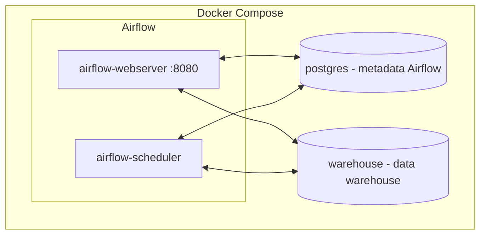
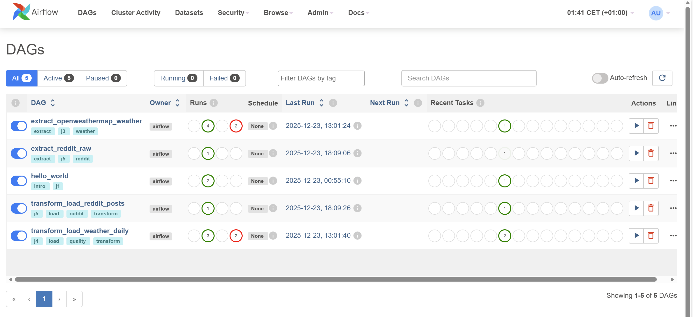
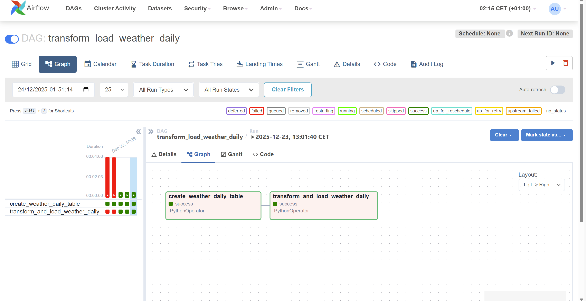
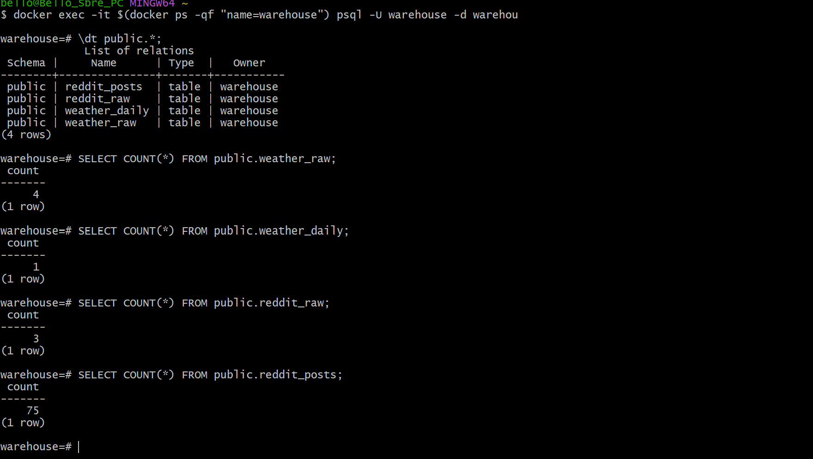
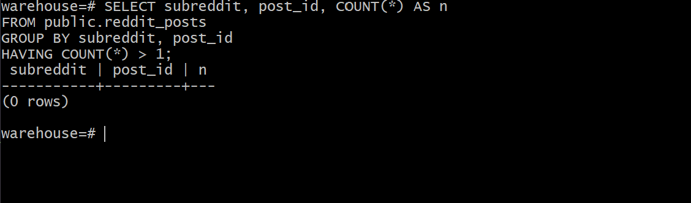

# Projet #3 — Data Engineering : ETL + Airflow + Postgres (Docker)

## Vue d’ensemble

Pipeline orchestré (Airflow) avec 2 sources et un entrepôt Postgres :

- Weather (OpenWeatherMap) : `weather_raw` → `weather_daily`
- Reddit (public JSON) : `reddit_raw` → `reddit_posts`

```mermaid
flowchart LR
  subgraph Sources
    W[OpenWeatherMap API]
    R[Reddit JSON]
  end

  subgraph Airflow
    A1[extract_openweathermap_weather]
    A2[transform_load_weather_daily]
    A3[extract_reddit_raw]
    A4[transform_load_reddit_posts]
  end

  subgraph Warehouse[(Postgres warehouse)]
    WR[(weather_raw)]
    WD[(weather_daily)]
    RR[(reddit_raw)]
    RP[(reddit_posts)]
  end

  W --> A1 --> WR --> A2 --> WD
  R --> A3 --> RR --> A4 --> RP
```

## Architecture Docker (services)



### Services Docker (résumé)

- **`airflow-webserver`**
  - **Rôle** : UI Airflow + API
  - **Port** : `8080:8080`
- **`airflow-scheduler`**
  - **Rôle** : planifie et exécute les tasks
  - **Port** : aucun
- **`postgres`**
  - **Rôle** : base de métadonnées Airflow
  - **Port** : non exposé (interne au réseau Docker)
- **`warehouse`**
  - **Rôle** : base de données cible (tables raw + tables “curated”)
  - **Port** : non exposé (interne au réseau Docker)

## Screenshots / Evidence

### Airflow





### Postgres (warehouse) — preuves





## J1 — Démarrage (Airflow UI + DAG minimal)

### Prérequis

- Docker Desktop installé et lancé

### Lancer Airflow

Depuis ce dossier :

```bash
docker compose up airflow-init
docker compose up
```

### Arrêter

```bash
docker compose down
```

### Postgres (warehouse)

Un second Postgres est lancé pour stocker les données ETL :

- Service docker : `warehouse`
- DB : `warehouse`
- User : `warehouse`
- Password : `warehouse`

Une table `weather_raw` est créée automatiquement au démarrage via `sql/`.

### Vérifier les données (psql)

Se connecter au warehouse :

```bash
docker exec -it $(docker ps -qf "name=warehouse") psql -U warehouse -d warehouse
```

Exemples :

```sql
SELECT COUNT(*) FROM public.weather_raw;
SELECT COUNT(*) FROM public.weather_daily;
SELECT COUNT(*) FROM public.reddit_raw;
SELECT COUNT(*) FROM public.reddit_posts;
```

### Airflow Connection

La connection Airflow `warehouse_postgres` est créée automatiquement au `airflow-init`.
Tu peux la voir dans l’UI : Admin → Connections.

### Accéder à l’UI

- URL : <http://localhost:8080>
- Login : `admin`
- Password : `admin`

### Vérifier le DAG

- DAG : `hello_world`
- Lance-le manuellement (bouton Play) puis vérifie les logs de la task `hello`.

## J3 — Extract Weather API (OpenWeatherMap)

### 1) Créer une clé API OpenWeatherMap

- Créer un compte : <https://home.openweathermap.org/users/sign_up>
- Récupérer la clé : <https://home.openweathermap.org/api_keys>

Note : la clé peut prendre quelques minutes à être activée.

### 2) Configurer les Airflow Variables

Dans l’UI Airflow : Admin → Variables

- `OPENWEATHER_API_KEY` : ta clé
- `OPENWEATHER_CITY` : `Lyon`
- `OPENWEATHER_COUNTRY` : `FR`

### 3) Lancer le DAG

- DAG : `extract_openweathermap_weather`
- Lance-le manuellement
- Vérifie ensuite que des lignes sont insérées dans `warehouse.public.weather_raw`

## J4 — Transform + checks qualité + load

### Objectif

- Transformer les JSON bruts (`weather_raw`) en colonnes analytiques (`weather_daily`)
- Appliquer des checks qualité (nulls / ranges / duplicates)
- Charger de façon idempotente (pas de duplicats sur `(city, country, obs_date)`)

### Lancer le DAG

- DAG : `transform_load_weather_daily`
- Lance-le manuellement après avoir exécuté l’extractor

### Validation attendue

- Task `create_weather_daily_table` : Success
- Task `transform_and_load_weather_daily` : Success
- Table `warehouse.public.weather_daily` contient des lignes

## J5 — 2e source : Reddit (public JSON)

### Notes

On utilise les endpoints publics JSON de Reddit (sans OAuth).
Reddit peut bloquer les requêtes si le `User-Agent` n’est pas explicite.

### 1) Configurer les Airflow Variables

Dans l’UI Airflow : Admin → Variables

- `REDDIT_SUBREDDITS` : `datascience,machinelearning,france`
- `REDDIT_LIMIT` : `25`
- `REDDIT_USER_AGENT` : ex `data-science-portfolio-etl/0.1 (by u/your_username)`

### 2) Lancer les DAGs

- DAG : `extract_reddit_raw`
- DAG : `transform_load_reddit_posts`

### Validation attendue (Reddit)

- Table `warehouse.public.reddit_raw` contient des payloads JSON
- Table `warehouse.public.reddit_posts` contient des posts
- Idempotence : relancer les DAGs ne crée pas de doublons sur `(subreddit, post_id)`

## Idempotence (mini-exercice)

### Weather

La table `weather_daily` est idempotente via la clé unique `(city, country, obs_date)`.

```sql
SELECT city, country, obs_date, COUNT(*) AS n
FROM public.weather_daily
GROUP BY city, country, obs_date
HAVING COUNT(*) > 1;
```

### Reddit

La table `reddit_posts` est idempotente via la clé unique `(subreddit, post_id)`.

```sql
SELECT subreddit, post_id, COUNT(*) AS n
FROM public.reddit_posts
GROUP BY subreddit, post_id
HAVING COUNT(*) > 1;
```

## Troubleshooting

- Si les DAGs n’apparaissent pas : vérifier que le dossier `dags/` est bien monté (container `airflow-webserver`) et relancer `docker compose up`.
- Si OpenWeather échoue : vérifier la variable `OPENWEATHER_API_KEY` (activation parfois lente).
- Si Reddit renvoie `403/429` : définir un `REDDIT_USER_AGENT` explicite et relancer.
